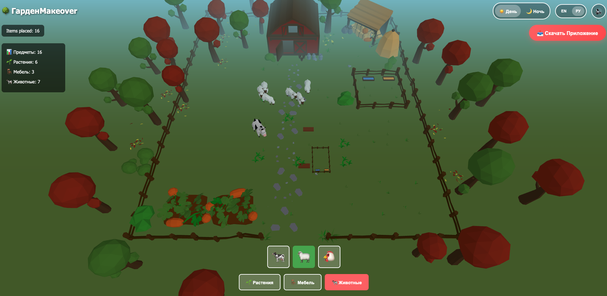

# 🌳 GardenMakeover - Interactive Garden Designer Ad

An interactive 3D garden designer playable ad built with Three.js and Vite. This is a demonstration of a mobile-friendly, engaging ad experience for a fictional garden design app.



<video src="./test_video.mov" controls width="720"></video>

## 🎯 Features

- **3D Interactive Garden Environment** - Beautiful 3D scene with dynamic lighting
- **Day/Night Toggle** - Switch between day and night lighting modes
- **Multiple Item Categories**:
  - 🌱 **Plants** (Corn, Grape, Strawberry, Tomato)
  - 🪑 **Furniture** (Bench, Fence, Flower Pot)
  - 🐄 **Animals** (Cow, Sheep, Chicken)
- **Smooth Animations** - Placement animations with particle effects
- **Mobile Responsive** - Optimized for all screen sizes
- **Sound Effects** - Click sounds and background music
- **Interactive Tutorial** - Hint system for new users
- **Statistics Tracking** - Real-time display of placed items
- **Particle System** - Visual feedback for item placement

## 🚀 Getting Started

### Prerequisites
- Node.js (v14 or higher)
- npm or yarn

### Installation

```bash
# Install dependencies
npm install

# Start development server
npm run dev

# Build for production
npm run build
```

The development server will start at `http://localhost:3000`

## 📁 Project Structure

```
test_ads/
├── index.html                 # Main HTML entry point
├── main.js                    # Application entry point
├── vite.config.js            # Vite configuration
├── package.json              # Project dependencies
├── js/
│   ├── SceneManager.js       # Three.js scene management & lighting
│   ├── ItemManager.js        # Item creation and management
│   ├── UIController.js       # UI interactions and buttons
│   ├── AudioManager.js       # Audio playback
│   └── ParticleSystem.js     # Particle effects
├── gltf/                     # 3D model files
│   ├── ground.glb
│   ├── ground2.glb
│   ├── objects.glb
│   └── objects2.glb
├── images/                   # UI graphics and sprites
│   ├── corn.png
│   ├── cow.png
│   ├── grape.png
│   ├── sheep.png
│   └── ...
└── sounds/                   # Audio files
    ├── click_003.mp3
    ├── theme.mp3
    ├── cow.mp3
    └── ...
```

## 🎮 How to Play

1. **Select Category** - Click "🌱 Plants", "🪑 Furniture", or "🐄 Animals"
2. **Choose Item** - Click on the desired item emoji button
3. **Place Item** - Click on the garden area to place the selected item
4. **Toggle Time** - Use the Day/Night toggle to change lighting
5. **Track Progress** - Watch your stats update in the bottom-right corner

## 🎨 Customization

### Adding New Items

Edit `js/ItemManager.js` and add to the categories:

```javascript
this.categories = {
    plants: [
        { type: 'newPlant', color: 0xFFD700, scale: 0.8 },
        // ...
    ]
}
```

### Changing Colors

Update the `color` values in `ItemManager.js` under each category.

### Adjusting Lighting

Modify `js/SceneManager.js` to change day/night lighting parameters.

## 🔧 Technologies Used

- **Three.js** - 3D graphics library
- **Vite** - Modern build tool and development server
- **ES6 Modules** - JavaScript modular architecture
- **CSS3** - Responsive styling

## 📱 Browser Support

- Chrome/Chromium (latest)
- Firefox (latest)
- Safari (latest)
- Mobile browsers (iOS Safari, Chrome Mobile)

## 🎯 Performance

- Optimized for 60 FPS gameplay
- Efficient particle system
- Dynamic lighting with shadow mapping
- Responsive design that adapts to all screen sizes

## 📦 Build Output

```bash
npm run build
```

Creates a `dist/` folder ready for deployment. All assets are bundled and optimized.

## 🎓 Code Quality

- Modular architecture with separate concerns
- Object-oriented design patterns
- Comprehensive comments and documentation
- Mobile-first responsive design

## 🌟 Bonus Features Implemented

✅ Day/Night toggle with dynamic lighting
✅ Tutorial/hint system on startup
✅ Particle effects for item placement
✅ Sound effects and background music
✅ Real-time statistics tracking
✅ Smooth animations and transitions
✅ Mobile-responsive UI

## 📝 License

Free to use for educational and commercial projects.

## 🤝 Support

For issues or questions, refer to the Three.js documentation or Vite documentation.

---

**Created with ❤️ using Three.js and Vite**
